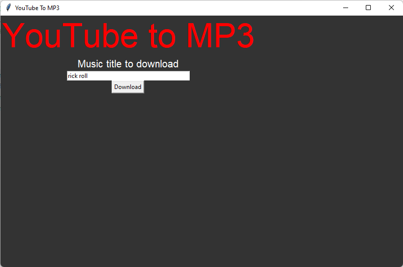

# PYTHON YOUTUBE TO MP3

This small app allow you to download a mp3 file from a YouTube video.
  

It use youtube_dl and youtubesearchpython libraries to get and download the
audio source.  

The interface was made with Tkinter module.  

## USAGE

To use the app you just have to launch the .exe file in the bin folder.
 
Then, type the name of the video you want to download, and it will download it
in the same folder you run the exe.

